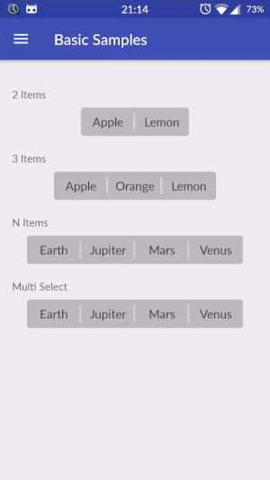
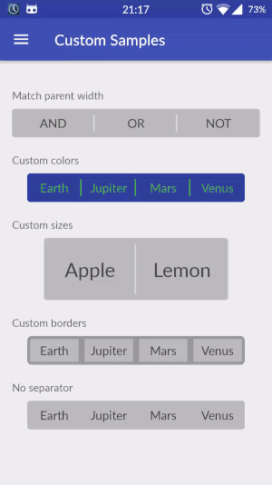

# Android-Toggle-Switch


[](http://android-arsenal.com/details/1/3235)


A customizable extension of Android Switches that supports also more than 2 items.


## Installation

#### Gradle
Add Gradle dependency:

```groovy
dependencies {
    compile 'us.belka:androidtoggleswitch:1.2.2'
}
```

#### Maven
```xml
<dependency>
  <groupId>us.belka</groupId>
  <artifactId>androidtoggleswitch</artifactId>
  <version>1.2.2</version>
  <type>pom</type>
</dependency>
```

## Basic Usage



#### 2 Items

```xml
<belka.us.androidtoggleswitch.widgets.ToggleSwitch
        android:layout_width="wrap_content"
        android:layout_height="wrap_content"
        custom:textToggleLeft="OR"
        custom:textToggleRight="AND"/>
```
#### 3 Items

```xml
<belka.us.androidtoggleswitch.widgets.ToggleSwitch
        android:layout_width="wrap_content"
        android:layout_height="wrap_content"
        custom:textToggleCenter="XOR"
        custom:textToggleLeft="OR"
        custom:textToggleRight="AND"/>
```

#### N - Items support

This can be accomplished in two ways:
* `xml`: In this way you have to define the `android:entries` attributes
as a `string-array`.
* `programmatically`: you have to set the entries as `List<String>`, `CharSequence[]`, etc.

XML
```xml
<belka.us.androidtoggleswitch.widgets.ToggleSwitch
        android:layout_width="wrap_content"
        android:layout_height="wrap_content"
        android:entries="@array/planets"/>
```

Programmatically
```java
ToggleSwitch toggleSwitch = (ToggleSwitch) findViewById(R.id.multiple_switches);
ArrayList<String> labels = new ArrayList<>();
labels.add("AND");
labels.add("OR");
labels.add("XOR");
labels.add("NOT");
labels.add("OFF");
toggleSwitch.setLabels(labels);
```

NOTE: Providing the entries using the `android:entries` attribute,
the attributes textToggle[Left/Center/Right] will be ignored.

#### Multiple checked items support

Simply use `MultipleToggleSwitch` instead of `ToggleSwitch`.

```xml
<belka.us.androidtoggleswitch.widgets.MultipleToggleSwitch
        android:id="@+id/multiple_toggle_switch"
        android:layout_width="wrap_content"
        android:layout_height="wrap_content"
        custom:textToggleCenter="Center"
        custom:textToggleLeft="Left"
        custom:textToggleRight="Right"/>                
```

## Getters and Setters


#### Toggle Switch

* `int getCheckedPosition()` Returns the current checked pos, -1 if none is checked.

```java
int pos = toggleSwitch.getCheckedPosition();
```

* `void setCheckedPosition(int pos)` Checks the pos passed as argument.

```java
int pos = 3;
multipleToggleSwitch.setCheckedPosition(pos);
```

#### Multiple Toggle Switch

* `List<Integer> getCheckedPositions()` Returns the list of the current checked positions

```java
List<Integer> checkedPositions = multipleToggleSwitch.getCheckedPositions();
```

* `void setCheckedPositions(List<Integer> checkedPositions)` Checks the pos passed as argument

```java
List<Integer> checkedPositions = new ArrayList();
checkedPositions.add(3);
checkedPositions.add(5);
multipleToggleSwitch.setCheckedTogglePositions(checkedPositions);
```

## Listeners

```java
toggleSwitch.setOnToggleSwitchChangeListener(new ToggleSwitch.OnToggleSwitchChangeListener(){
      @Override
      public void onToggleSwitchChangeListener(int pos, boolean isChecked) {
	// Write your code ...
      }
  });
```

## Customization



#### Attributes

It is possible to customize the buttons applying the following options:


| Option Name      				    | Format         | Description                  |
| ---------------- 				    | -------------- | -----------------------------            |
| android:textSize 				    | `dimension`  	 | Text size of each button                 |
| custom:activeBgColor        | `color`        | Background color of the checked button    |
| custom:activeTextColor      | `color`        | Text color of the checked button |
| custom:inactiveBgColor 	    | `color`		     | Background color of the inactive buttons  |
| custom:inactiveTextColor    | `color`        | Text color of the inactive buttons       |
| custom:separatorColor       | `color`        | Color of the vertical separator between inactive buttons  |
| custom:toggleWidth    		  | `dimension`    | Width of each button  |
| custom:borderRadius			    | `dimension`	   | Corner Radius in dp |

#### Example

```xml
<belka.us.androidtoggleswitch.widgets.ToggleSwitch
        android:layout_width="wrap_content"
        android:layout_height="wrap_content"
        android:textSize="18sp"
        custom:activeBgColor="@android:color/holo_blue_dark"
        custom:activeTextColor="@android:color/white"
        custom:inactiveBgColor="@android:color/white"
        custom:inactiveTextColor="@android:color/black"
        custom:separatorColor="@color/gray_very_light"
        custom:textToggleCenter="APPLE"
        custom:textToggleLeft="ORANGE"
        custom:textToggleRight="BANANA"
        custom:toggleWidth="104dp"/>
```


## Contributors
Lorenzo Rigato,
Fabrizio Rizzonelli, Android Developer @[Belka](https://github.com/BelkaLab)

## License
Android-Toggle-Switch is Copyright (c) 2016 Belka, srl. It is free software, and may be redistributed under the terms specified in the LICENSE file.  

## About Belka


[Belka](http://belka.us/en) is a Digital Agency specialized in design, mobile applications development and custom solutions.
We love open source software! You can [see our projects](http://belka.us/en/portfolio/) or look at our case studies.

Interested? [Hire us](http://belka.us/en/contacts/) to help build your next amazing project.

[www.belka.us](http://belka.us/en)
