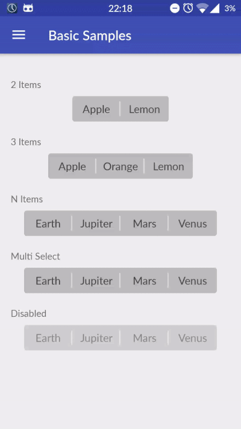
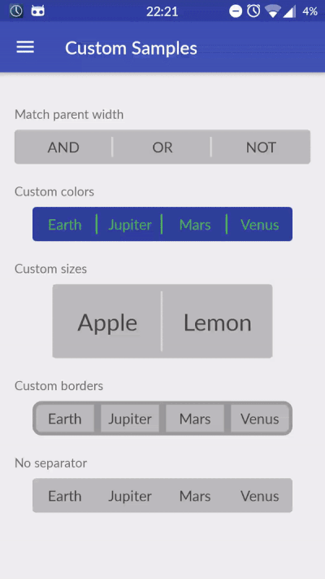
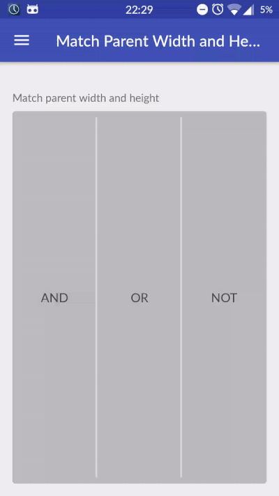
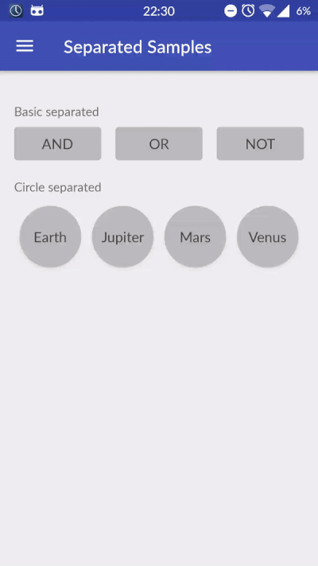
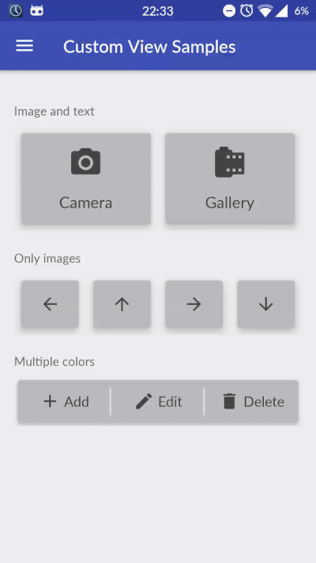

# Android-Toggle-Switch


[](http://android-arsenal.com/details/1/3235)

A customizable extension of Android Switches that supports also more than 2 items.

## Installation

#### Gradle
Add Gradle dependency:

```groovy
dependencies {
    compile 'com.llollox.androidprojects:androidtoggleswitch:2.0.0'
}
```

#### Maven
```xml
<dependency>
  <groupId>com.llollox.androidprojects</groupId>
  <artifactId>androidtoggleswitch</artifactId>
  <version>2.0.0</version>
  <type>pom</type>
</dependency>
```

## Basic Usage



#### 2 Items

```xml
<com.llollox.androidprojects.androidtoggleswitch.widgets.ToggleSwitch
    android:layout_width="wrap_content"
    android:layout_height="wrap_content"
    app:textToggleLeft="@string/apple"
    app:textToggleRight="@string/lemon" />
```

#### 3 Items

```xml
<com.llollox.androidprojects.androidtoggleswitch.widgets.ToggleSwitch
    android:layout_width="wrap_content"
    android:layout_height="wrap_content"
    app:textToggleLeft="@string/apple"
    app:textToggleCenter="@string/orange"
    app:textToggleRight="@string/lemon"/>
```

#### N - Items support

This can be accomplished in two ways:
* `xml`: In this way you have to define the `android:entries` attributes
as a `string-array`.
* `programmatically`: you have to set the entries as `List<String>`, `CharSequence[]`, etc.

XML
```xml
<com.llollox.androidprojects.androidtoggleswitch.widgets.ToggleSwitch
    android:layout_width="wrap_content"
    android:layout_height="wrap_content"
    android:entries="@array/planets"/>
```

Programmatically
```java
ToggleSwitch toggleSwitch = (ToggleSwitch) findViewById(R.id.multiple_switches);
ArrayList<String> labels = new ArrayList<>();
labels.add("AND");
labels.add("OR");
labels.add("XOR");
labels.add("NOT");
labels.add("OFF");
toggleSwitch.setLabels(labels);
```

NOTE: Providing the entries using the `android:entries` attribute,
the attributes textToggle[Left/Center/Right] will be ignored.

#### Multiple checked items support

Simply use `MultipleToggleSwitch` instead of `ToggleSwitch`.

```xml
<com.llollox.androidprojects.androidtoggleswitch.widgets.MultipleToggleSwitch
    android:id="@+id/multiple_toggle_switch"
    android:layout_width="wrap_content"
    android:layout_height="wrap_content"
    custom:textToggleCenter="Center"
    custom:textToggleLeft="Left"
    custom:textToggleRight="Right"/>                
```

## Getters and Setters

#### Toggle Switch

* `int getCheckedPosition()` Returns the current checked pos, -1 if none is checked.

```java
int pos = toggleSwitch.getCheckedPosition();
```

* `void setCheckedPosition(int pos)` Checks the pos passed as argument.

```java
int pos = 3;
multipleToggleSwitch.setCheckedPosition(pos);
```

#### Multiple Toggle Switch

* `List<Integer> getCheckedPositions()` Returns the list of the current checked positions

```java
List<Integer> checkedPositions = multipleToggleSwitch.getCheckedPositions();
```

* `void setCheckedPositions(List<Integer> checkedPositions)` Checks the pos passed as argument

```java
List<Integer> checkedPositions = new ArrayList();
checkedPositions.add(3);
checkedPositions.add(5);
multipleToggleSwitch.setCheckedTogglePositions(checkedPositions);
```

## Listeners

#### Toggle Switch

```java
toggleSwitch.setOnChangeListener(new ToggleSwitch.OnChangeListener(){
    @Override
    public void onToggleSwitchChanged(int position) {
       // Your code ...
    }
});
```

#### Multiple Toggle Switch

```java
multipleToggleSwitch.setOnChangeListener(new ToggleSwitch.OnChangeListener(){
    @Override
    public void onMultipleToggleSwitchChanged(int position, boolean checked) {
       // Your code ...
    }
});
```

## Customization




#### Border

It is possible to customize:
* the color of the border of both checked and unchecked buttons with `app:checkedBorderColor` and `app:uncheckedBorderColor` respectively
* the border width with the attribute `app:borderWidth`
* the border radius with the attribute `app:borderRadius`

Since by default the `borderWidth` is 0, it is important to set it at least
to `1dp` in order to show the border.

```xml
<com.llollox.androidprojects.androidtoggleswitch.widgets.MultipleToggleSwitch
    android:layout_width="wrap_content"
    android:layout_height="wrap_content"
    android:entries="@array/planets"
    app:borderRadius="8dp"
    app:borderWidth="4dp"
    app:checkedBorderColor="@color/teal"
    app:uncheckedBorderColor="@color/gray_border"/>
```

#### Color

It is possible to customize:
* the background color of both checked and unchecked buttons with `app:checkedBackgroundColor` and `app:uncheckedBackgroundColor` respectively
* the text color of both checked and unchecked buttons with `app:checkedTextColor` and `app:uncheckedTextColor` respectively

```xml
<com.llollox.androidprojects.androidtoggleswitch.widgets.ToggleSwitch
    android:layout_width="wrap_content"
    android:layout_height="wrap_content"
    android:entries="@array/planets"
    app:checkedBackgroundColor="@color/orange"
    app:checkedTextColor="@android:color/white"
    app:uncheckedBackgroundColor="@color/colorPrimaryDark"
    app:uncheckedTextColor="@color/green"
    app:separatorColor="@color/green"/>
```

#### Size

By default each button has a predefined width and height.
It is possible to customize both of them with the attributes `app:toggleWidth` and `app:toggleHeight` respectively.

NB. In order to let the attributes `app:toggleHeight` and `app:toggleWidth`to work
properly, it is **very** important to set the attributes `android:layout_height`
and `android:layout_width` setted as `wrap_content` respectively.

```xml
<com.llollox.androidprojects.androidtoggleswitch.widgets.ToggleSwitch
    android:layout_width="wrap_content"
    android:layout_height="wrap_content"
    app:textToggleLeft="@string/apple"
    app:textToggleRight="@string/lemon"
    android:textSize="26sp"
    app:toggleHeight="82dp"
    app:toggleWidth="122dp"/>
```

In fact, setting one of them to `match_parent` the respectively `app:toggle<Height/Width>`
will be ignored since the following cases happen:
* `android:layout_width=match_parent` then the parent's width is distributed evenly
between the buttons.
* `android:layout_height=match_parent` then each button takes all the parent view height.

An example of setting both attributes to `match_parent` is shown below.



#### Programmatically Customization

All customizations can be done also programmatically.
Once all the properties has been properly set, it's necessary
to call the method `reDraw()`

## Separated Buttons

In order to create separated buttons, just set the `android:toggleMargin` attribute
with a value (in `dp`) greater than 0.

Obviously when the toggle buttons are separated the separator is hidden.
That's why in this case both the attributes
`app:separatorVisible` and `app:separatorColor` will be ignored.

An example of separate toggle buttons is shown below.



## Custom View

In case you want something more complex than a simple text into each button,
you can specify your own view.



Let's suppose you want toggle buttons with an icon and a label below.
The layout xml of your view should be something similar to the following one,
called `view_image_text_toggle_button.xml`

```xml
<LinearLayout
  xmlns:android="http://schemas.android.com/apk/res/android"
  xmlns:tools="http://schemas.android.com/tools"
  android:orientation="vertical"
  android:layout_width="wrap_content"
  android:layout_height="wrap_content"
  android:gravity="center">

  <ImageView
    android:id="@+id/image_view"
    android:layout_width="40dp"
    android:layout_height="40dp"
    android:tint="@color/gray"/>

  <TextView
    android:id="@+id/text_view"
    android:layout_width="wrap_content"
    android:layout_height="wrap_content"
    android:layout_marginTop="12dp"
    android:textSize="18sp"
    tools:text="Camera"/>

</LinearLayout>
```

In order to assign this layout to each toggle switch button call the method:

```java
public void setView(int layoutId, int numEntries,
    ToggleSwitchButton.ToggleSwitchButtonDecorator prepareDecorator,
    ToggleSwitchButton.ViewDecorator checkedDecorator,
    ToggleSwitchButton.ViewDecorator uncheckedDecorator)
```                

Here a detailed explanation of the arguments:
* **layoutId**: the resourceId of the layout to be inflated into each toggle button
* **numEntries**: the number of entries (buttons)
* **prepareDecorator**: set a prepare decorator in order to set the customization to be
  done for each button, like setting for each one the proper label, icon, etc.
* **checkedDecorator**: set a checked decorator in order to set the customization to be
  done for each checked button, like a proper background color, text color etc.
* **uncheckedDecorator**: set an unchecked decorator in order to set the customization to be
  done for each unchecked button, like a proper background color, text color etc.

```java
toggleSwitch.setView(
  R.layout.view_image_text_toggle_button,
  2,
  new ToggleSwitchButton.ToggleSwitchButtonDecorator() {
    @Override
    public void decorate(ToggleSwitchButton toggleSwitchButton, @NotNull View view, int position) {
        TextView textView   = (TextView) view.findViewById(R.id.text_view);
        textView.setText(getCameraGalleryLabel(position));

        ImageView imageView = (ImageView) view.findViewById(R.id.image_view);
        imageView.setImageDrawable(getCameraGalleryDrawable(position));
    }
  },
  new ToggleSwitchButton.ViewDecorator() {
    @Override
    public void decorate(@NotNull View view, int position) {
        TextView textView   = (TextView) view.findViewById(R.id.text_view);
        textView.setTextColor(ContextCompat.getColor(getActivity(), android.R.color.white));

        ImageView imageView = (ImageView) view.findViewById(R.id.image_view);
        imageView.setColorFilter(ContextCompat.getColor(getActivity(), android.R.color.white));
    }
  },
  new ToggleSwitchButton.ViewDecorator() {
    @Override
    public void decorate(@NotNull View view, int position) {

        TextView textView   = (TextView) view.findViewById(R.id.text_view);
        textView.setTextColor(ContextCompat.getColor(getActivity(), R.color.gray));

        ImageView imageView = (ImageView) view.findViewById(R.id.image_view);
        imageView.setColorFilter(ContextCompat.getColor(getActivity(), R.color.gray));
    }
  });

private String getCameraGalleryLabel(int position) {
  switch (position) {
    case 0: return getString(R.string.camera);
    case 1: return getString(R.string.gallery);
    default: throw new RuntimeException("Unknown position");
  }
}

private Drawable getCameraGalleryDrawable(int position) {
  switch (position) {
    case 0: return ContextCompat.getDrawable(getActivity(), R.drawable.ic_camera_alt_black_24dp);
    case 1: return ContextCompat.getDrawable(getActivity(), R.drawable.ic_camera_roll_black_24dp);
    default: throw new RuntimeException("Unknown position");
  }
}
```

Both checked and unchecked decorator are optional.
In case you have no customization to be done you can call the simpler method

```java
public void setView(int layoutId, int numEntries,
  ToggleSwitchButton.ToggleSwitchButtonDecorator prepareDecorator)
```   

Since you are using your own view only the following attributes will not work:
* `android:entries`
* `app:checkedTextColor`
* `app:uncheckedTextColor`


## Bonus

#### Disabled

You can disable the toggle switch buttons by:
* **xml**: set the attribute `android:enabled=false`
* **programmatically**: ```java toggleSwitch.setEnabled(false)```

In this case they become not clickable.
You can see an example at the top of the documentation in basic samples gif example.

#### Elevation

In order to specify the elevation of the toggle buttons,
add the following attribute:

```xml
  app:elevation=<dimension_dp>
```

You can see an example in the custom view gif example.

## Attributes

Summarizing the full list of all available attributes to customize the
toggle switch buttons is shown below.

| Option Name      				       | Format          | Description                                      |
| ---------------- 				       | --------------  | -----------------------------                    |
| android:enabled 				       | `boolean`  	   | Enable or disable the toggle switch buttons      |
| android:entries 				       | `array`  	     | Set the labels of each button                    |
| android:textSize 				       | `dimension`  	 | Text size of each button                         |
| app:checkedBackgroundColor     | `color`         | Background color of a checked button             |
| app:checkedBorderColor         | `color`         | Border color of a checked button                 |
| app:checkedTextColor           | `color`         | Text color of a checked button                   |
| app:borderRadius			         | `dimension`	   | The border radius of each button in dp           |
| app:borderWidth                | `dimension`     | The width of the border of each button in dp     |
| app:uncheckedBackgroundColor   | `color`		     | Background color of the unchecked buttons        |
| app:uncheckedBorderColor       | `color`         | Border color of a unchecked button               |
| app:uncheckedTextColor         | `color`         | Text color of the unchecked buttons              |
| app:separatorColor             | `color`         | Color of the vertical separator between buttons  |
| app:separatorVisible           | `boolean`       | Set if the separator is visible or not           |
| app:toggleMargin    		       | `dimension`     | Margin between each button in dp                 |
| app:toggleHeight    		       | `dimension`     | Height of each button                            |
| app:toggleWidth    		         | `dimension`     | Width of each button                             |


## Contributors
Lorenzo Rigato,
Fabrizio Rizzonelli, Android Developer @[Belka](https://github.com/BelkaLab)

## License
Android-Toggle-Switch is Copyright (c) 2016 Belka, srl. It is free software, and may be redistributed under the terms specified in the LICENSE file.  

## About Belka


[Belka](http://belka.us/en) is a Digital Agency specialized in design, mobile applications development and custom solutions.
We love open source software! You can [see our projects](http://belka.us/en/portfolio/) or look at our case studies.

Interested? [Hire us](http://belka.us/en/contacts/) to help build your next amazing project.

[www.belka.us](http://belka.us/en)
